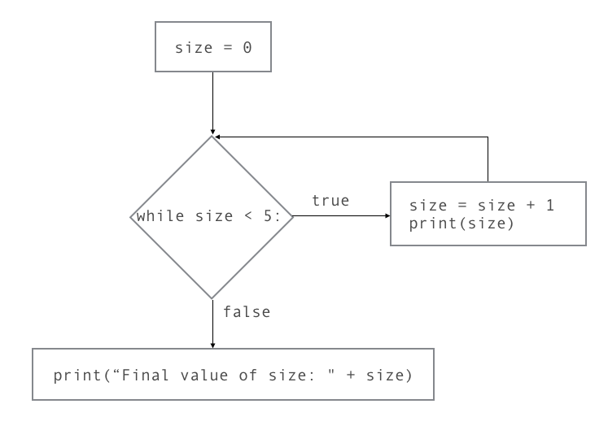
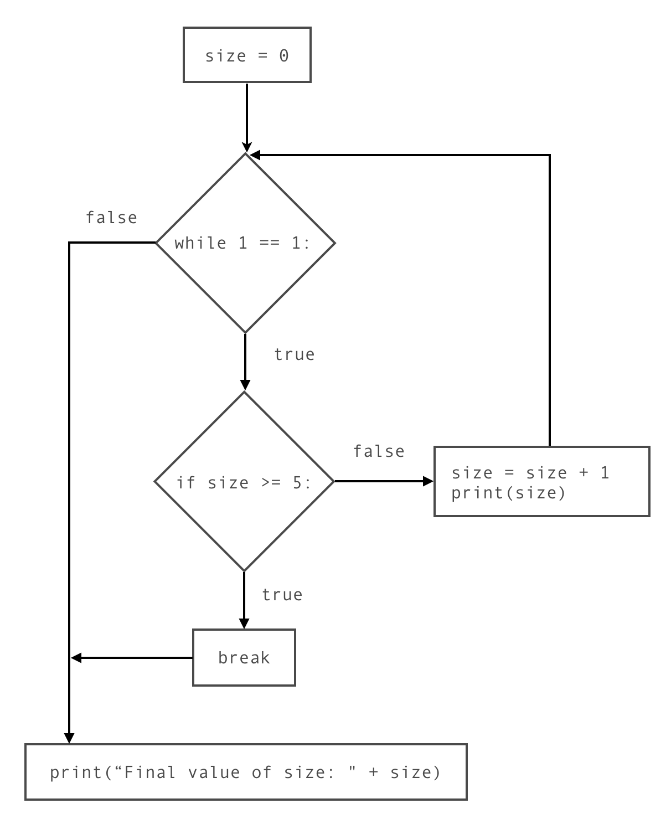

..  Copyright (C)  Mark Guzdial, Barbara Ericson, Briana Morrison
    Permission is granted to copy, distribute and/or modify this document
    under the terms of the GNU Free Documentation License, Version 1.3 or
    any later version published by the Free Software Foundation; with
    Invariant Sections being Forward, Prefaces, and Contributor List,
    no Front-Cover Texts, and no Back-Cover Texts.  A copy of the license
    is included in the section entitled "GNU Free Documentation License".

.. |bigteachernote| image:: Figures/apple.jpg
    :width: 50px
    :align: top
    :alt: teacher note

..  qnum::
    :start: 1
    :prefix: csp-12-11-
    
.. highlight:: java
   :linenothreshold: 4

|bigteachernote| Teacher note: Misconception - While exits immediately
======================================================================

Some students hold the misconception that the while loop *exits immediately* after its condition becomes **false**. For instance:

.. activecode:: While1

    size = 0

    while size < 5:
        size = size + 1
        print(size)
        
    print("Final value of size: " + str(size))

In this example, ``size`` becomes 5 at the last iteration of the loop, but before its value is printed. A student who held this misconception would predict that the output of this program would be as follows, leaving out the 5:

::

    1
    2
    3
    4
    Final value of size: 5

**Correct understanding** The correct behavior of ``while`` loops is that its condition is only checked after the entire loop body is executed.

This flowchart illustrates how the above example is executed:

    
    Figure 1: While loop flowchart.

Stepping through this flowchart might help students understand the execution flow through the ``while`` loop.

What is the correct output of the program, then? Practice tracing through the flowchart and enter your answer here:

Alternative: Infinite loops with break
--------------------------------------

If your students are having difficulty understanding the execution flow of the ``while`` loop, here’s an alternative way of structuring this loop that has been shown to be much easier for students to grasp:

.. sourcecode:: python

    while 1 == 1:
        if <condition>:  # replace <condition> with the condition for exiting the loop
            break
        <loop body>      # replace <loop body> with the loop body

It’s an infinite loop with an explicit ``break`` statement ``if`` a certain condition is true. Let’s break that statement down:

**Infinite loop** You’ll recognize the `infinite loop from a previous section <http://interactivepython.org/runestone/static/TeacherCSP/CSPWhileAndForLoops/infinite.html>`__. While normally we try to avoid infinite loops, in this case it is safe to use since we also have the explicit ``break``.

**break statement** When a ``break`` statement is encountered inside a loop, it causes execution to exit the loop, skipping the rest of the loop body. In the following program, the last two lines of the loop body are never executed, because the loop exits at the ``break`` statement.

.. activecode:: While2

    while 1 == 1:
        print("This line gets executed (but only once!)")
        break      # loop exits here
        print("This line doesn't get executed")
        print("Neither does this")
        
    print("Outside of the loop")

Question: If this is an infinite loop, why is the first line only printed one time?

*Answer: The loop does not repeat because of the break statement, so the first line is only executed once.*

Now that we’ve considered these individual pieces on their own, let’s put them back together:

.. sourcecode:: python

    while 1 == 1:
        if <condition>:  # replace <condition> with the condition for exiting the loop
            break
        <loop body>      # replace <loop body> with the loop body

This is an infinite loop with an explicit ``break`` statement ``if`` a certain condition is true.

**Back to our example** Here is the example above, structured using an infinite loop:

.. activecode:: While3
   :tour_1: "Structural tour"; 1: InfiniteWhile-line1; 2: InfiniteWhile-line2; 3: InfiniteWhile-line3; 4: InfiniteWhile-line4; 5-6: InfiniteWhile-line5-6; 7: InfiniteWhile-line7;

   size = 0
   while 1 == 1:              # infinite loop
       if size >= 5:          # exit condition
           break              # explicit break
       size = size + 1        # loop body
       print(size)            # loop body
   print("Final value of size: " + str(size))

Run the above program. Inspect the output to check whether this new loop is indeed identical to our original ``while`` loop.

**Code lens walkthrough**

Before watching this video, walk through the code by hand and answer these questions:

1. How many times is the line ``while 1 == 1`` evaluated?
2. How many times is the line ``if size >= 5`` evaluated?
3. How many times is the line ``break`` evaluated?
4. How many times is the line ``print(size)`` evaluated?

We discuss the answers at the end of the video.

.. youtube:: SZ7UMV9bNK0
    :height: 315
    :width: 560
    :align: left

Here’s the flowchart that corresponds to this new structure:

    
    Figure 2: Flowchart for infinite while-loop with break.

As above, practice stepping through this flowchart to see the execution flow.

**Flowchart: step-through**

.. youtube:: -9BxL2QCWN0
    :height: 315
    :width: 560
    :align: left

In summary, structuring loops this way requires an infinite loop, plus the condition to **stop** repeating the body. That condition goes in the ``if`` statement (containing the ``break`` ) immediately after the ``while`` statement, followed by the loop body (the code you want to repeat).

Why is this way of structuring ``while`` loops better? Because it makes the point at which the loop exits **explicit**.

In the original version, execution returns to the *top* of the loop after the body is executed, but if the condition is false, execution then jumps to *after the end of the body* to exit the loop. This exit of the loop is implied, not stated.

In the infinite-loop version, however, the fact that the condition is checked at every repeat of the loop is spelled out, and the explicit ``break`` statement clearly indicates the point at which the loop exits.
