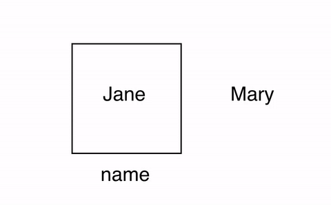
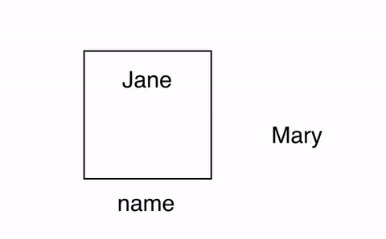
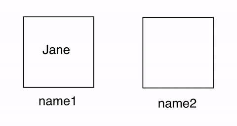

..  Copyright (C)  Mark Guzdial, Barbara Ericson, Briana Morrison
    Permission is granted to copy, distribute and/or modify this document
    under the terms of the GNU Free Documentation License, Version 1.3 or
    any later version published by the Free Software Foundation; with
    Invariant Sections being Forward, Prefaces, and Contributor List,
    no Front-Cover Texts, and no Back-Cover Texts.  A copy of the license
    is included in the section entitled "GNU Free Documentation License".

.. |teachernote| image:: Figures/apple.jpg
    :width: 30px
    :align: top
    :alt: teacher note
    
.. |bigteachernote| image:: Figures/apple.jpg
    :width: 50px
    :align: top
    :alt: teacher note

.. |runbutton| image:: Figures/run-button.png
    :height: 20px
    :align: top
    :alt: run button

.. |audiobutton| image:: Figures/start-audio-tour.png
    :height: 20px
    :align: top
    :alt: audio tour button

.. |codelensfirst| image:: Figures/codelens-first.png
    :height: 20px
    :align: top
    :alt: move to first button

.. |codelensback| image:: Figures/codelens-back.png
    :height: 20px
    :align: top
    :alt: back button

.. |codelensfwd| image:: Figures/codelens-forward.png
    :height: 20px
    :align: top
    :alt: forward (next) button

.. |codelenslast| image:: Figures/codelens-last.png
    :height: 20px
    :align: top
    :alt: move to last button
    
.. 	qnum::
	:start: 1
	:prefix: csp-3-2-

.. highlight:: java
   :linenothreshold: 4

|bigteachernote| Teacher Note: Limits of the box analogy
=========================================================

In this book we use a labelled box as an analogy for variables. However, this analogy only goes so far. Below are a few of the misconceptions students form when thinking of variables as boxes, compared to how variables actually work:

**Boxes can contain more than one value at a time** 

On the other hand, variables can only contain one value at a time. Take the following sequence of assignment statements:

.. activecode:: Assign1

    name = "Jane"
    name = "Mary"
    print(name)

If the variable ``name`` were a box, what does it now contain after these two assignments? This is the correct behavior: “Mary” will replace “Jane” as the value of ``name``. You can verify this by running the above code and observing the output.

    
    Figure 1: Correct model for successive assignments.

However, if the student misapplied the box analogy, she might say that ``name`` now contains **both** “Jane” and “Mary”.

    
    Figure 2: Incorrect model for successive assignments.

**You take an object out of a box before placing it in another**

Students may take this prior understanding of boxes and misapply them to variables when dealing with assignment. For example, what is printed out after this running this program?

.. activecode:: Assign2

    name1 = "Jane"
    name2 = name1
    print(name1)
    print(name2)

What happens during the assignment in line 2? The value of ``name1`` is **copied** into ``name2``. The correct prediction to make is that “Jane” is printed two times.

    
    Figure 3: Correct model for assigning a value from one variable to another.

However, a student may interpret line 2 to mean “take the value in the box ``name1`` and **move** it to the box ``name2``\ “. This will leave nothing in ``name1``, leaving it empty. She may predict then that the first print will display nothing, while the second print will display “Jane”. This is incorrect.

    
    Figure 4: Incorrect model for assigning a value from one variable to another.

Boxes may be a useful analogy to understand variables, but it’s important to highlight that not everything about boxes applies.

